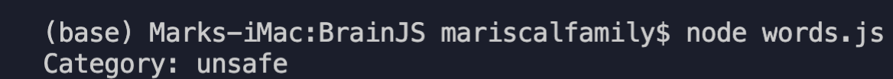

## Table of contents
* [General info](#general-info)
* [Technologies](#technologies)
* [Setup](#setup)

## General info
Used Brain.js, a GPU accelerated library for Neural Networks ,created JSON data with possible texts that could be flagged as “unsafe” , returned unsafe or null depending on what out input was passed to the network 
	
## Technologies
Project is created with:
* Brain.js
* Node.js
	
## Setup
To run this project, install it locally using npm:

```
$ npm install brain.js
$ node words
```


